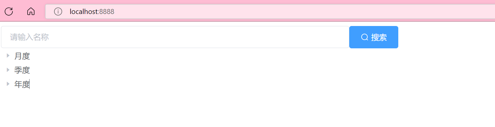
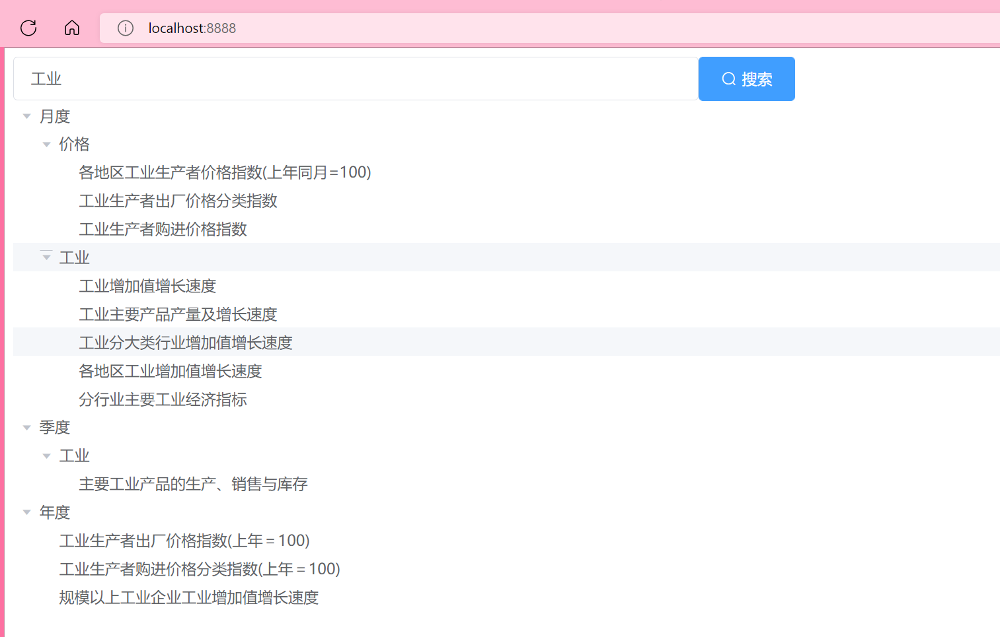

# 项目介绍

该工程为后端项目treemenu-web的前端。

# 开发环境

其前端开发环境为 Vue.js+Element-UI。

项目演示地址：http://localhost:8888
                      

# 目录结构

```  
├─.public                     存放静态文件
├─src                      
│  ├─assets                   存放各种静态文件
│  ├─components               存放公共组件 
│  ├─views                    存放各种页面
│  ├─App.vue                  项目的主组件, 引入其他模块       
│  └─main.js                  初始化vue实例  
├─babel.config.js             工具链     
├─package.json                模块基本信息项目开发所需要模块，版本，项目名称
└─vue.config.js               保存vue配置的文件
```


# 项目使用（开发环境）

1. 建议在运行该前端工程前先自行安装好Node.js，以便使用`npm`，下载地址为 https://mirrors.tuna.tsinghua.edu.cn/nodejs-release/v16.14.2/node-v16.14.2-x64.msi ，
 可在命令提示符窗口或终端中执行`npm -v`检查是否安装成功；
    ```
    npm -v
    ```

2. 其次再安装好Vue CLI，安装步骤网上有详细步骤；

3. 克隆项目的地址后，打开Intellij IDEA后，分别点击File > New > Project from Version Control ，再将克隆下来的地址粘贴到URL框中；

4. 在IntelliJ IDEA的Terminal窗口中分别执行；
  ```
  npm install
  npm run serve
  ```
<br/>
5. 执行以上命令即可启动项目，启动成功后，即可看提示：
  ```
  App running at:
     - Local:   http://localhost:8888/
     - Network: http://192.168.3.180:8888/
  npm run serve
   ```
 
>提示：可能某些电脑上会显示多个网址，这并不重要

<br/>
6. 当项目启动后，在提示了启动成功的端口窗口中，按下Ctrl + C即可停止服务。<br/>
7. 建议打开edge和Chrome浏览器，通过 http://localhost:8888/ 网址进行访问，即可看到默认的页面，如下图：

 　
  当在搜索框中输入“工业“时，依次点开当前节点，页面会以树结构菜单进行展开，如下图：
　 <br/>


